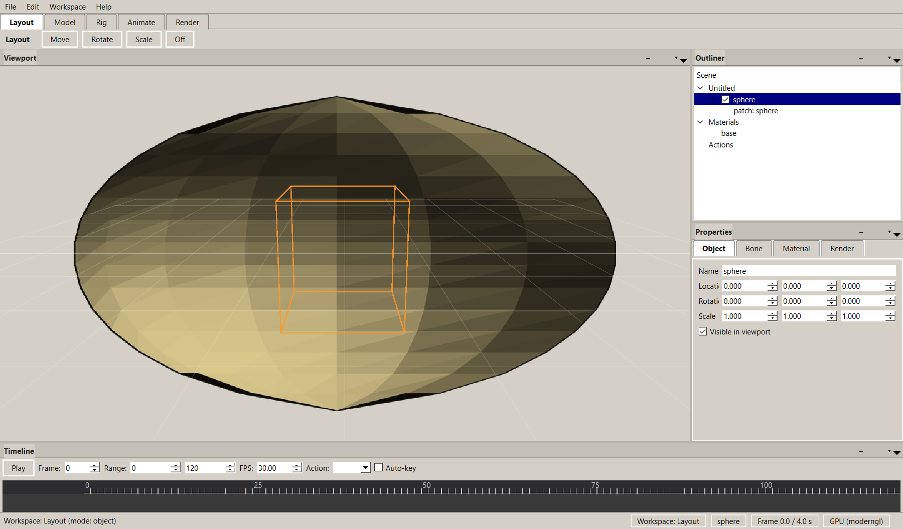

# 3D MASTER:2005

A lightweight, pure **spline-based** 3D character animation suite — a modern
revival of the no-longer-updated Animation Master 2005.

The differentiator: there are **no polygon meshes in the data model**. All
geometry is defined by intersecting B-splines forming 3- and 4-sided
patches.  Surfaces stay mathematically smooth at any render resolution while
the on-disk representation remains tiny (just control points + knot
vectors).

## Interface



The PySide6 desktop editor provides dedicated Layout, Model, Rig, Animate,
and Render workspaces around the spline-patch viewport.

## Status

| Subsystem | State | Tests |
|-----------|-------|-------|
| B-spline kernel (de Boor, NURBS, clamped knots, patches) | done | 10 |
| Core document model (Project / Object / Spline / Patch / Hook) | done | (via facade) |
| Scriptable facade (`am3d.core.script`) — agentic pipeline ready | done | 8 |
| Animation & Action-reuse system | done | 6 |
| Rigging: FK, analytic 2-bone IK, SmartSkins | done | 6 |
| Serializer (`.am3a` actions, `.am3d` projects) | done | 4 |
| Renderer tessellation bridge + UV mapping & atlas packing | done | 7 |
| Headless sprite-sheet renderer (software rasterizer → PNG) | done | 5 |
| Exporters: Wavefront OBJ + binary glTF 2.0 (`.glb`) | done | 3 |
| Recipe schema — the LLM contract (validated JSON) | done | 10 |
| Procedural primitives (sphere/box/cylinder/cone/torus/plane) | done | 18 |
| Procedural actions (walk / idle / jump generators) | done | 6 |
| Recipe executor + CLI (`python -m am3d.recipes`) | done | 13 |
| Project serializer: patches, bones, hooks, transforms (`.am3d`) | done | 7 |
| Thread-isolated scripting sessions (`reset_default`) | done | 2 |
| Procedural textures + atlas baking (checker/bricks/noise/…) | done | 17 |
| Toon shader: cel bands + ink lines (headless NPR) | done | 10 |
| Material node graph (mix/tint/noise_overlay chains) | done | 10 |
| Qt UI (four-mode workspace) | scaffolded | — |
| GPU multi-pass renderer (ModernGL headless G-buffer → PBR) | done | 6 |
| Qt UI (four-mode workspace, viewport, timeline, file I/O) | done | 2 |
| Action retargeting (cross-skeleton animation reuse) | done | 5 |
| Volumetrics (exponential height fog + god rays post-process) | done | (gpu/postprocess) |

Run the whole test-suite:

```bash
python -m pytest am3d/
```

## LLM workflow: one JSON -> finished assets

An LLM emits a recipe; the engine does the rest:

```bash
python -m am3d.recipes --recipe scripts/knight_recipe.json --out ./assets/demo
```

That single command builds geometry from procedural primitives, rigs a biped
skeleton, generates walk + idle animations, and writes `knight.obj`,
`knight.glb`, `knight_project.am3d` and per-object PNG **sprite sheets**.

The recipe contract (see `scripts/knight_recipe.json`):

```json
{
  "name": "knight",
  "objects": [
    {"name": "torso", "primitive": "sphere", "params": {"radius": 0.45}},
    {"name": "hero", "bones": [
      {"name": "hip", "head": [0,0.9,0], "tail": [0,1.0,0]},
      {"name": "spine", "head": [0,1.0,0], "tail": [0,1.4,0], "parent": "hip"}
    ]}
  ],
  "actions": [{"name": "walk", "kind": "walk", "character": "hero"}],
  "exports": [
    {"format": "obj", "path": "knight"},
    {"format": "glb", "path": "knight"},
    {"format": "spritesheet", "path": "knight_sprite",
     "params": {"views": 8, "size": 96}}
  ]
}
```

* **primitives**: `sphere`, `box`, `cylinder`, `cone`, `torus`, `plane`,
  `lathe`, `extrude`
* **action kinds**: `walk`, `idle`, `jump`, or `custom` with explicit keys
* **exports**: `obj`, `glb` (`gltf` accepted as an alias), `spritesheet`,
  `toon_sheet`, `am3d`

Invalid recipes are rejected with human-readable problems before anything
is written; runtime failures come back as structured errors with exit code 1.

## Python API (headless)

```python
from am3d.core import script

s = script.Session()
s.new_project("demo")
s.create_object("vase")
s.add_spline("vase", [(0.4,0,0), (1.0,0.6,0), (0.7,1.4,0)], name="profile")
s.lathe_spline("vase", "profile", axis="y", sections=24)

from am3d.renderer import tessellate_project, save_sprite_sheet
for name, mesh in tessellate_project(s.project).items():
    save_sprite_sheet(mesh, f"{name}.png", views=8, size=128)
```

Or drive everything through one executor call:

```python
from am3d.recipes.executor import RecipeExecutor
result = RecipeExecutor().execute(recipe_dict)
print(result.ok, result.exports, result.errors)
```

## Layout

```
am3d/
├── spline/      # geometry kernel (Numba-accelerated B-splines)
├── core/        # data model, scripting, animation, rigging, serializer
├── renderer/    # tessellation + UVs + headless sprite rasterizer
├── export/      # OBJ and binary glTF writers
└── recipes/     # LLM contract: schema, primitives, animation gens,
                 #   executor, CLI (`python -m am3d.recipes`)
scripts/         # runnable demos + example knight_recipe.json
assets/          # sample .am3a/.am3d assets and demo output
```

## Dependencies

Python 3.10+ with numpy, scipy, numba, moderngl(+window), msgpack, PySide6.
See `requirements.txt`.
