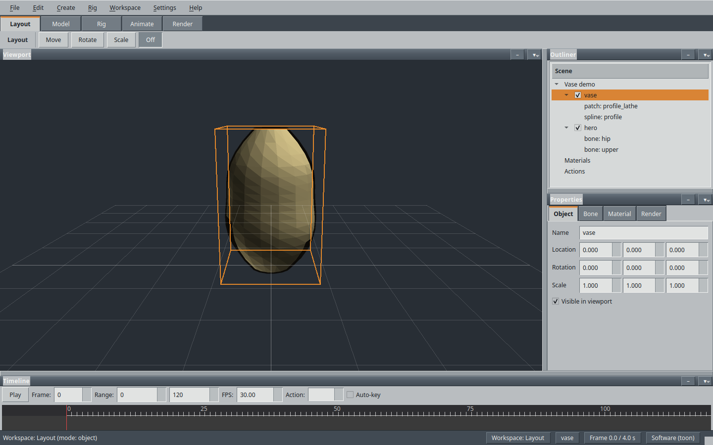

# 3D MASTER:2005

3D MASTER:2005 is a spline-patch modeling and animation editor with a
machine-readable recipe pipeline for AI-generated assets. B-spline surfaces
are the editable source model; polygon meshes are produced for rendering and
export.

## Interface



The desktop editor has Layout, Model, Rig, Animate, and Render workspaces. The
visual direction is a dense 3D workbench with early-2000s desktop character.
See [DESIGN.md](DESIGN.md) and [PRODUCT.md](PRODUCT.md).

## AI-agent workflow

The product does not embed a language model. An external model or agent reads
the shipped [recipe guide](docs/recipes/EXTERNAL_AGENT_GUIDE.md), emits JSON
matching the versioned schema, and invokes the recipe CLI. The CLI validates
the recipe, returns structured errors that an agent can correct, then writes
an editable `.am3d` project and requested exports. Open that project in the
desktop editor to inspect, refine, or animate it.

From a source checkout:

```bash
python -m am3d.recipes \
  --recipe docs/recipes/examples/knight_full.json \
  --out ./generated/knight
```

For a Linux portable bundle, invoke `./am3d-recipe` with the same arguments.
The JSON result on standard output includes an artifact manifest; diagnostics
go to standard error. `--validate-only` checks a recipe without generating
artifacts. See the [quick start](docs/QUICK_START.md) for bundle usage and the
[agent guide](docs/recipes/EXTERNAL_AGENT_GUIDE.md) for the correction loop.

The recipe surface supports primitives, lathe/extrude profiles, materials and
patterns, bones, generated/custom actions, native projects, OBJ/GLB, and
sprite/toon/animation sheets. OBJ and GLB are static tessellated pose
snapshots; `.am3d` retains editable scene and animation data. The
[capability matrix](docs/CAPABILITY_MATRIX.md) distinguishes recipe, engine,
and GUI features.

## Status and supported platforms

See [supported platforms](docs/SUPPORTED_PLATFORMS.md) for verified builds,
platform status, and qualification limits. Historical build and review
evidence is linked from that document.

The recipe path is currently code-first and external-agent driven. There is
no in-app prompt box or model-provider integration. The desktop app is the
integrated review and editing surface for generated projects.

## Development

Python source installations declare Python 3.10+ with NumPy, msgpack, PySide6,
and Pillow. The pinned frozen-build environment uses Python 3.11+; see
`requirements-lock-linux.txt` and
[the platform policy](docs/SUPPORTED_PLATFORMS.md). Install the development
requirements with:

```bash
python -m pip install -r requirements-dev.txt
```

Run the project checks with:

```bash
python -m pytest am3d/
```

The active product plan is [docs/V1_PLAN.md](docs/V1_PLAN.md). Build scripts
and their evidence remain in the repository history.
